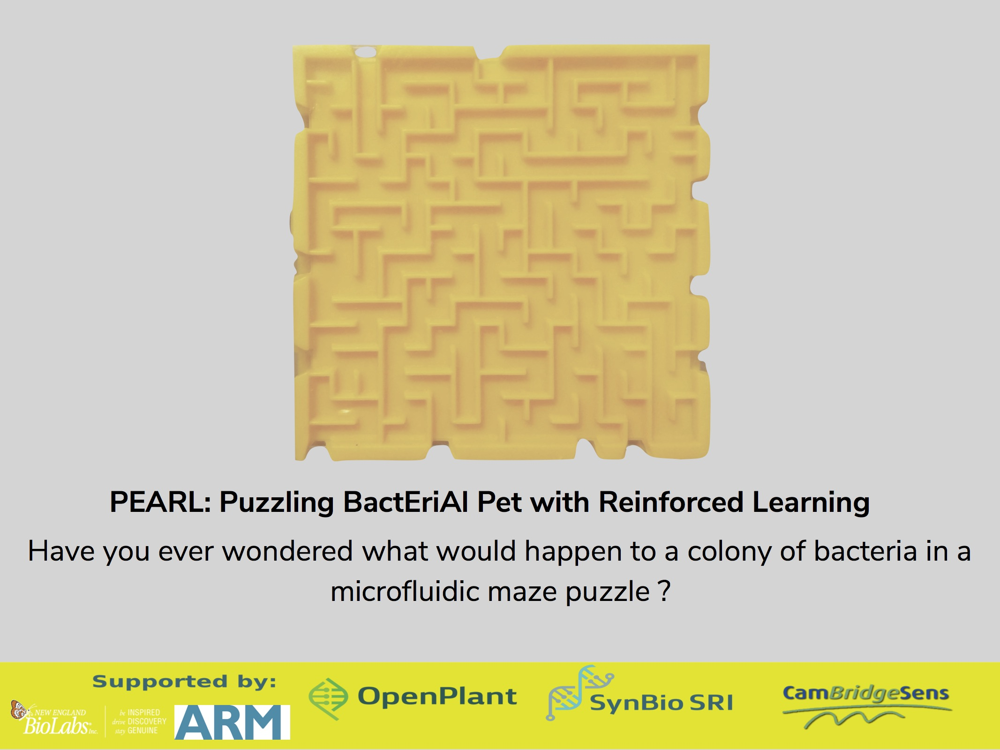

## Synopsis

This proposal is for developing a programmable staging mount, and an imaging platform for a microfluidics based conditioned learning hub for motile bacterial cells. By developing a maze traversal challenge, we aim to create different scenarios for chemotactic bacterial colonies to employ their decision-making machinery and navigate their way out of the maze. By isolating successful colonies and progressing them further to solve more complex mazes, we aim to identify strains of bacteria which are good at solving maze traversing puzzles. The potential learning from this could lead to an understanding of cognition, memory and learning in bacterial colonies. In addition to this, by measuring complexity level of each of the maze designs, we hope to arrive at an understanding of a bacterial colony’s ability to learn from its experience of solving maze traversal puzzles. 

## Software

Explain functionality of software components (if any) as concisely as possible, developers should be able to figure out how your project solves their problem by looking at the code example. Ideally, this should be pseudo code or an abstract graphical representation of your code e.g entity relationship diagram. Consider adding a screenshot of your User Interface.

## Hardware

Explain how the hardware components (if any) of your project function as concisely as possible, including a short description of fabrication and assembly. Component suppliers and part numbers should be provided separately in a bill of materials, in a 'Hardware Folder'.

## Installation, Maintenance and Testing Guide

Provide instructions on usage, describe a test scheme and show how to run the tests with code and hardware configuration examples with some representative results.

## License

A short snippet describing the license (MIT, Apache, etc.) you have chosen to use
